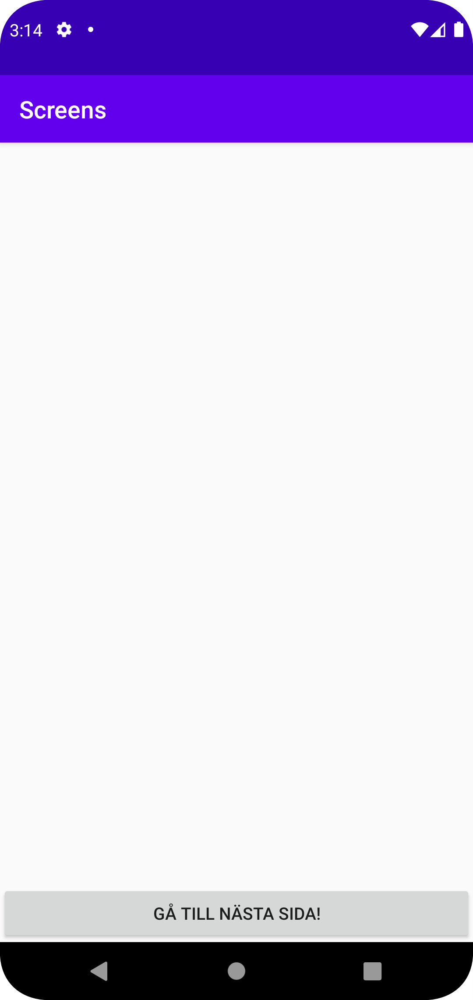
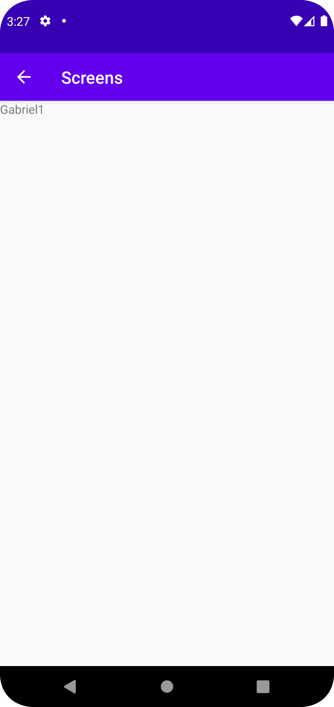

# Rapport
För denna inlämning så skapade jag en till activity för både xml och java för att kunna 
skapa ett sätt att flytta mellan de olika skärmarna. Det man gjorde var att skapa en view 
som var button som skulle agera som en explicit intent, så när man tryckte på knappen så skulle 
man tas till nästa skärm. Genom intent putextra så kunde man skicka med data till nästa sida. 
```
minKnapp.setOnClickListener(new View.OnClickListener() {
    @Override
    public void onClick(View view) {
        Log.d("==>","Injera Mmmm");
        Intent intent = new Intent(MainActivity.this, MainActivity2.class);
        intent.putExtra("name", "Gabriel"); // Optional
        intent.putExtra("number", 1); // Optional
        startActivity(intent);
    }
});

Bundle extras = getIntent().getExtras();
if (extras != null) {
    String name = extras.getString("name");
    int number = extras.getInt("number");
    Log.d("==>", name + number);
    TextView minText = findViewById(R.id.minTxt);
    inText.setText(name.concat(Integer.toString(number)));
}
```



